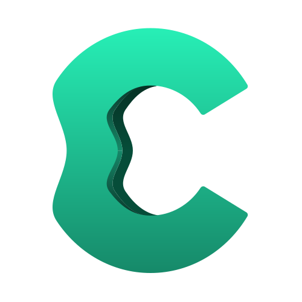

<div align="center">
  

# Cove

A media streaming app for Linux and Windows. Discover, track, and stream movies and TV shows — powered by TMDB metadata, Stremio & Nuvio compatible addons & plugins, and a built-in mpv player.

[](https://github.com/coveninja/cove/actions/workflows/ci.yml)
[](https://codecov.io/gh/coveninja/cove)
[](https://github.com/coveninja/cove/releases/latest)
[](LICENSE)
[](https://go.dev)
[](https://www.jetbrains.com/compose-multiplatform/)

[](#install)
[](https://github.com/coveninja/cove/releases/latest)
[](https://github.com/coveninja/cove/stargazers)
[](https://github.com/coveninja/cove/issues)
[](CONTRIBUTING.md)
</div>

> **Disclaimer:** Cove is a media player and organizer, not a content host. It does not provide, index, or distribute any media itself — a fresh install has zero sources configured. Any streams come from third-party Stremio-compatible addons or community plugins that *you* choose to add. You're responsible for what you connect to and for complying with the laws in your jurisdiction.

## Table of Contents

- [Features](#features)
- [Localization](#localization)
- [Install](#install)
- [Build from source](#build-from-source)
- [Development](#development)
- [Testing and CI](#testing-and-ci)
- [Configuration](#configuration)
- [Documentation](#documentation)
- [Community & Support](#community--support)
- [Star History](#star-history)
- [Roadmap / Known Limitations](#roadmap--known-limitations)

## Features

- **Stream anything** — connects to Stremio-compatible addon sources and streams directly in the app
- **Extend with plugins** — add community JS scraper plugins for additional stream sources, sandboxed and opt-in per scraper
- **Built-in player** — hardware-accelerated mpv playback with subtitle support, live buffering/download progress, and progress saving
- **Smart stream picker** — auto-selects the best available stream using a configurable strategy (quality, size, reliability, or a connection-speed match via a built-in speed test), or sort/filter candidates yourself
- **Skip intro & recap** — auto-skip buttons for intro, recap, and credits segments during playback, independently toggleable
- **Where to watch** — see which legal streaming/rental services carry a title alongside the stream picker
- **Discover** — personalized recommendations based on your watch history, ratings, and taste profile
- **Library** — track what you've watched, mark favorites, and pick up where you left off with continue watching
- **Explore** — browse trending, upcoming releases, genres, and curated categories
- **Insights** — view your watch stats and genre/actor taste breakdown
- **Search** — find any movie or TV show by title
- **Spoiler-free browsing** — optionally blurs thumbnails and titles for unwatched episodes
- **Multiple profiles** — profile switching, works fully offline with no sign-in required
- **Accounts & sync** — optional sign-in syncs your library and preferences across devices
- **Trakt.tv integration** — optional Trakt sign-in scrobbles what you watch in real time and two-way syncs your watch history and watchlist with Trakt automatically
- **Cross-platform architecture** — Go backend and Compose Multiplatform desktop app share a clean HTTP boundary; the backend is frontend-agnostic

## Install

### Arch / CachyOS (PKGBUILD)

Install via the AUR:

```sh
yay -S cove-bin
```

Or download `PKGBUILD` from the [latest release](https://github.com/coveninja/cove/releases/latest) manually and run `makepkg -si` in the same directory. To update, repeat with the new release's `PKGBUILD`.

### Flatpak — any Linux distro

Download `cove-linux-amd64.flatpak` from the [latest release](https://github.com/coveninja/cove/releases/latest), then:

```sh
flatpak install --user cove-linux-amd64.flatpak
flatpak run io.github.coveninja.Cove
```

### Windows

Download `cove-windows-amd64-setup.exe` from the [latest release](https://github.com/coveninja/cove/releases/latest) and run the installer. Or grab `cove-windows-amd64.zip` for a portable install.

### Android & Android TV

Not currently supported. The previous Kotlin WebView shell was removed along with the Svelte UI it hosted. There is no Android APK in current releases. A proper Android port targeting the Compose Multiplatform modules is planned as a separate project — see [Roadmap](#roadmap--known-limitations).

### macOS

Not currently supported. There's no native build or packaging for macOS yet — see [Roadmap](#roadmap--known-limitations).

## Build from source

**Prerequisites:** Go 1.26+, JDK 17+, and libmpv (`mpv` on Arch/CachyOS, `libmpv-dev` on Debian/Ubuntu)

```sh
git clone https://github.com/coveninja/cove
cd cove
echo "TMDB_API_KEY=your_key_here" > .env
make run  # builds everything and launches the app
```

> Need a TMDB key? Create a free account at [themoviedb.org](https://www.themoviedb.org/), then generate one under **Settings → API** in your account.

### Individual builds

```sh
make go   # build the Go backend binary only
make app  # build the Compose Desktop app only
make dev  # alias for make run
make hot  # launch with automatic Compose UI hot reload
```

## Testing and CI

The standard target exercises both the public/no-op build and the checked-in
`supabase` auth/sync implementation. Maintainers with both private submodules
can separately run the exact release combination with `supabase,discover`.

```sh
make test      # Go + Kotlin test suites
make test-all  # add workflow/security checks and static cross-platform builds
```

The check requiring private sources is kept explicit:

```sh
make test-private  # maintainers, after make inject-private
```

Pull requests and branch pushes run the full matrix in
[`ci.yml`](.github/workflows/ci.yml): formatting/vet, public and tagged Go
tests, the race detector, Linux/Windows builds, the Kotlin shared/desktop test
suite, dependency review, and vulnerability scanning. Coverage reports are
retained as workflow artifacts and published to Codecov for the badge above;
the current baseline is informational rather than a merge threshold.

## Configuration

A fresh profile ships with no provider addons and no plugin repos enabled — only two hardcoded "official" integrations (streaming-availability lookup, intro/recap timestamps) work out of the box. To get streams, add one or more Stremio-compatible addon URLs and/or community plugin repos in the app's Settings page.

## Documentation

- [ARCHITECTURE.md](ARCHITECTURE.md) — how the Go backend and Compose Multiplatform app fit together, the playback data flow, and the open-source/proprietary build-tag split
- [docs/API.md](docs/API.md) — HTTP endpoint reference
- [docs/TESTING.md](docs/TESTING.md) — local test commands, CI matrix, coverage, and release gates
- [CONTRIBUTING.md](CONTRIBUTING.md) — dev setup and code style for contributors

## Community & Support

- **Bugs & feature requests:** [GitHub Issues](https://github.com/coveninja/cove/issues)
- **Questions & discussion:** [GitHub Discussions](https://github.com/coveninja/cove/discussions)

New contributors are welcome — see [CONTRIBUTING.md](CONTRIBUTING.md) for dev setup and code style before opening a PR.

## Localization

658 message keys × 7 locales (en, de, es, it, ja, pt, tr) are preserved in `app/i18n/messages/`, salvaged from the deleted Svelte UI before that tree was removed. They are **not wired into the Compose app yet** — nothing reads them at build or run time. When the real screens exist, the relevant keys will be converted to Compose string resources and the rest dropped. See `app/i18n/messages/README.md` for context.


## Star History

<a href="https://www.star-history.com/?repos=coveninja%2Fcove&type=date&legend=top-left">
 <picture>
   <source media="(prefers-color-scheme: dark)" srcset="https://api.star-history.com/chart?repos=coveninja/cove&type=date&theme=dark&legend=top-left&sealed_token=4GbbMkGKGiaXN1d60vfao3mhJl3TIFYWtueyZuta_mcDXrGkF63OQqyv4VgSp4DbPhGKYc8UNJubllPuYou3pnWPc9IAmJuem_27FHCoO_20WiA7vsx4LQ" />
   <source media="(prefers-color-scheme: light)" srcset="https://api.star-history.com/chart?repos=coveninja/cove&type=date&legend=top-left&sealed_token=4GbbMkGKGiaXN1d60vfao3mhJl3TIFYWtueyZuta_mcDXrGkF63OQqyv4VgSp4DbPhGKYc8UNJubllPuYou3pnWPc9IAmJuem_27FHCoO_20WiA7vsx4LQ" />
   
 </picture>
</a>

## Roadmap / Known Limitations

- **macOS** is not yet supported — no native build exists
- **Android** is not currently supported — the previous Kotlin WebView shell was removed with the Svelte UI; a proper Compose Multiplatform port is planned
- The **desktop UI** is intentional scaffolding — the maintainer is designing and writing the real screens
- Have a request? Open an [issue](https://github.com/coveninja/cove/issues) to discuss it
