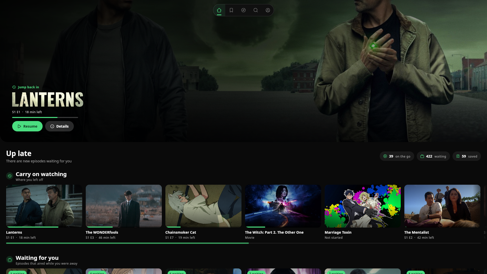
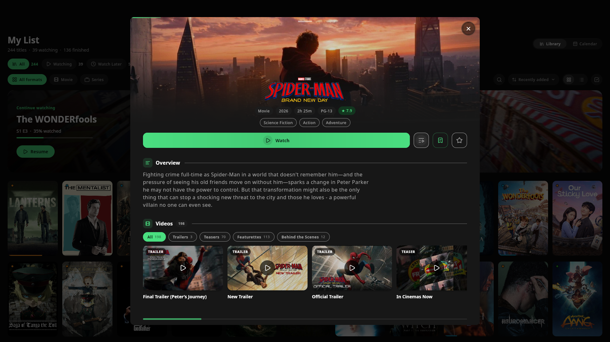
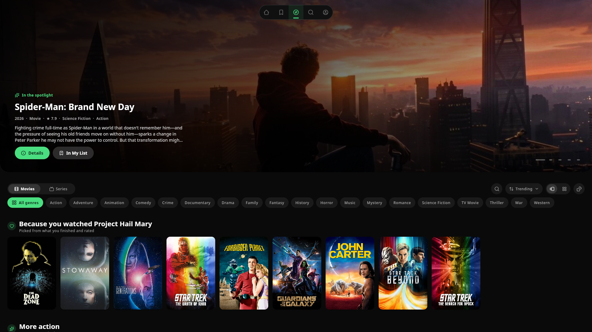
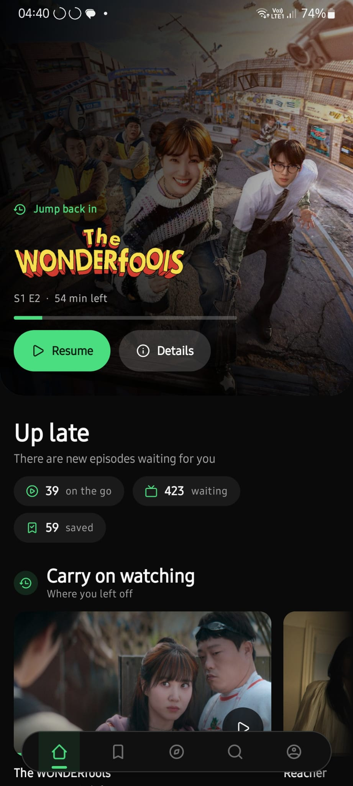
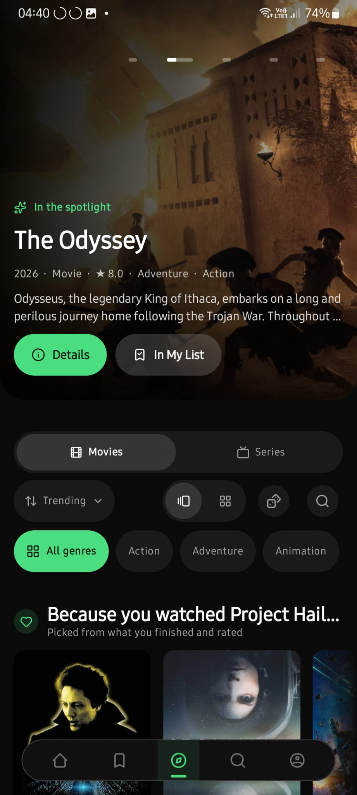
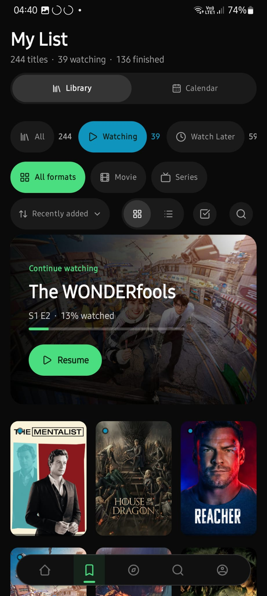

<div align="center">
  

  <h1>Cove</h1>

  <p><strong>Discover, organize, and play your media in one native application.</strong></p>

  <p>
    Cove brings a personal library, rich discovery, extensible sources, and
    hardware-accelerated playback to Linux, Windows, macOS, and Android phones,
    tablets, and televisions.
  </p>

  <p align="center">
    <a href="https://buymeacoffee.com/coveninja">
      
    </a>
  </p>

  <p>
    <a href="#installation">Installation</a> ·
    <a href="#building-from-source">Build from source</a> ·
    <a href="#architecture">Architecture</a> ·
    <a href="#documentation">Documentation</a> ·
    <a href="https://cove.ninja/docs">User guides</a> ·
    <a href="CONTRIBUTING.md">Contributing</a>
  </p>

  <p>
    <a href="https://github.com/coveninja/cove/actions/workflows/ci.yml"></a>
    <a href="https://github.com/coveninja/cove/releases/latest"></a>
    <a href="LICENSE"></a>
    <a href="https://www.jetbrains.com/compose-multiplatform/"></a>
  </p>
</div>

> [!IMPORTANT]
> Cove is a media player and organizer, not a content host or provider. A fresh
> installation contains no third-party stream sources. You are responsible for
> the addons and plugins you configure and for following the laws that apply in
> your jurisdiction.

## Screenshots

### Desktop

<p align="center">
  <a href="docs/screenshots/desktop-home.png">
    
  </a>
  <a href="docs/screenshots/desktop-title-details.png">
    
  </a>
  <a href="docs/screenshots/desktop-discover.png">
    
  </a>
  <br />
  <sub>Home &nbsp;·&nbsp; Title details &nbsp;·&nbsp; Discovery</sub>
</p>

### Android

<p align="center">
  <a href="docs/screenshots/android-home.jpg">
    
  </a>
  <a href="docs/screenshots/android-discover.jpg">
    
  </a>
  <a href="docs/screenshots/android-library.jpg">
    
  </a>
  <br />
  <sub>Home &nbsp;·&nbsp; Discovery &nbsp;·&nbsp; Library</sub>
</p>

## Features

### Discovery and organization

- Personalized recommendations informed by watch history, ratings, and taste.
- Search, trending and upcoming titles, genres, curated collections, and people.
- A profile-scoped library with favorites, progress, continue watching, and
  spoiler protection for unwatched episodes.
- Multiple local profiles, with optional account sync and Trakt integration.

### Playback

- Native, hardware-accelerated mpv playback on desktop and Android.
- Direct HTTP and torrent playback with subtitles and live buffering progress.
- Automatic stream selection by quality, size, reliability, or measured
  connection speed, plus full manual sorting and filtering.
- Configurable intro, recap, and credits skipping, with progress saved as you watch.

### Sources and extensions

- Stremio-compatible addons for catalogs, streams, subtitles, and metadata.
- Opt-in community scraper plugins executed behind platform-specific isolation.
- Legal watch-option discovery alongside configured playback sources.
- Local-first profiles and settings: signing in is optional.

## Platform support

| Platform | Status | Distribution | Update path |
|---|---|---|---|
| Linux | Available | AUR, Flatpak, tarball | `cove-bin` through `pacman`; Flatpak bundles and tarballs are replaced manually |
| Windows | Available | Installer, portable ZIP | Verified in-app updates for both forms beginning with `1.0.0` |
| Android phone/tablet | Available | APK, Android 9+ | Verified APK through Android's package installer |
| Android TV | Preview | Same APK, Android 9+ | Verified APK through Android's package installer |
| macOS (Apple silicon) | Available | Ad-hoc signed DMG, not notarized | Manual release replacement |

One APK serves both phones and televisions: `leanback` is declared optional, and
the app selects the touch or ten-foot shell at runtime from `FEATURE_LEANBACK`.

## Installation

All downloadable packages are published on the
[GitHub Releases](https://github.com/coveninja/cove/releases/latest) page.

### Arch Linux and CachyOS

Install the AUR package with your preferred helper:

```sh
yay -S cove-bin
```

Updates remain managed by `pacman` and your AUR workflow.

### Flatpak

Download `cove-linux-amd64.flatpak` from the latest release, then run:

```sh
flatpak install --user cove-linux-amd64.flatpak
flatpak run io.github.coveninja.Cove
```

Standalone Flatpak bundles are replaced manually when a new version is released.

### Other Linux distributions

Download `cove-linux-amd64.tar.gz` from the latest release. It carries its own
Java runtime and expects libmpv from your distribution. An installed `yt-dlp`
is preferred for YouTube extras; when none is available, Cove can download and
maintain its own copy unless that setting is disabled. The bundled `bin/cove`
launcher resolves the application through an absolute
`/usr/lib/cove` path, so `/usr` is the only prefix it works under:

```sh
sudo tar -xzf cove-linux-amd64.tar.gz -C /usr
cove
```

Tarball installations are replaced manually when a new version is released.

### Windows

Download one of the following from the latest release:

- `cove-windows-amd64-setup.exe` for a conventional installation.
- `cove-windows-amd64-portable.zip` for a self-contained portable copy.

Both distributions support signed, verified in-app updates beginning with
`1.0.0`.

> [!IMPORTANT]
> Upgrading to `1.0.0` from a pre-`1.0.0` Windows build is a manual step.
> `1.0.0` replaced the previous Qt and Go application with a single native one,
> so the two installations share no layout. Download the installer or portable
> ZIP above and install it yourself; those older builds will not offer `1.0.0`
> in-app, by design. Your library, profiles, and settings are preserved.

### macOS

`cove-macos-arm64.dmg` is an Apple-silicon build that bundles libmpv and its
native runtime dependencies, so you need neither Homebrew nor a separate API key.
Intel Macs are not supported.

The DMG is ad-hoc signed rather than notarized, because Cove has no Apple
Developer ID. macOS attaches its quarantine flag to whatever a *browser*
downloads, and that flag is what triggers Gatekeeper — so fetching the DMG from a
terminal avoids the whole thing:

```sh
curl -LO https://github.com/coveninja/cove/releases/latest/download/cove-macos-arm64.dmg
open cove-macos-arm64.dmg
```

Drag Cove into Applications and it launches normally, with no prompt to approve.

> [!NOTE]
> Downloading the DMG in a browser instead is fine, but Gatekeeper will then
> refuse the first launch with "Apple could not verify 'Cove' is free of
> malware." Clear the flag and it starts:
>
> ```sh
> xattr -dr com.apple.quarantine /Applications/Cove.app
> ```
>
> Or approve it once under **System Settings → Privacy & Security**, scrolling to
> the message naming Cove and choosing **Open Anyway**. On macOS 15 and newer
> that is the only click-through route left — right-click → Open no longer
> bypasses the check.
>
> Ad-hoc signing is not a trust credential; it is what lets the binaries execute
> at all on Apple silicon, which refuses to run a wholly unsigned one. macOS gets
> no in-app updates either way, so replace the DMG by hand.

### Android phone, tablet, and TV

Download and install `cove-android.apk` on Android 9 (API 28) or newer. The same
APK serves phones, tablets, and televisions, and picks the touch or ten-foot
shell to match the device it lands on. Android may ask you to allow installs
from Cove when applying the first in-app update. Cove verifies the package name,
version, release manifest, payload checksum, and installed signing certificate
before handing the APK to the system installer.

Upgrading from a pre-`1.0.0` APK works in place and keeps your data, because the
release is signed with the same key and carries a higher version code.

## Building from source

### Prerequisites

- JDK 21
- libmpv (`mpv` on Arch/CachyOS and Homebrew, or `libmpv-dev` on Debian/Ubuntu)
- Android SDK platform and build-tools 36 for Android builds
- A TMDB API key for live catalog data

Clone the repository, create your local configuration, and launch the desktop app
against the real backend:

```sh
git clone https://github.com/coveninja/cove.git
cd cove
cp .env.example .env
# Set TMDB_API_KEY in .env
cd app && ./gradlew :desktop:run --args="--backend-mode kotlin"
```

> [!NOTE]
> `--backend-mode kotlin` is what selects the real in-process backend. With no
> `--backend-mode` the desktop app falls back to a canned fixture library, so
> `make run` on its own will not show live data no matter how `.env` is set. A
> fixtures run labels itself with a **Fixture data** badge in the top corner.

Common development commands:

| Command | Purpose |
|---|---|
| `make run` | Build and launch the desktop application with fixture data |
| `make mobile` | Build the Android debug APK (phone, tablet, and TV) |
| `make hot` | Start the Compose hot-reload loop with fixture data |
| `make run-tv` | Launch the television shell in a desktop window |
| `make test` | Run the Kotlin test suites |
| `make test-build` | Build the desktop image and Android debug APK |
| `make test-all` | Run the broadest local approximation of CI |

On macOS, Homebrew provides both required local dependencies and Gradle can
create a native application bundle for the current Apple-silicon Mac:

```sh
brew install mpv
brew install --cask temurin@21
export JAVA_HOME="$(/usr/libexec/java_home -v 21)"
cd app
./gradlew :desktop:createDistributable --no-daemon
open desktop/build/compose/binaries/main/app/Cove.app
```

Desktop configuration is loaded from environment variables, the nearest `.env`,
and then bundled release properties. Android receives the same deployment values
through `BuildConfig` at build time. See [.env.example](.env.example) for the
supported keys. `COVE_DATA_DIR` overrides the desktop data directory; Android
always uses app-private storage.

## Architecture

Cove is a Kotlin Multiplatform application with two native hosts over one shared
application graph:

- `app/shared` defines domain models, repository contracts, and the app graph.
- `app/backend` owns local persistence, integrations, addons, discovery, sync,
  media boundaries, and host-specific runtime composition.
- `app/ui` contains the shared adaptive Compose presentation.
- `app/desktop` owns the desktop window, native mpv surfaces, lifecycle, and packaging.
- `app/mobile` owns Android lifecycle, system integration, native playback, and APK packaging.
- `app/benchmark` generates Android startup and baseline profiles; it is not an application host.

Ordinary UI operations stay in-process. An embedded, authenticated Ktor boundary
is retained only where URL semantics are required—for example media proxying,
torrent delivery, diagnostics, and optional LAN clients. SQLDelight provides the
shared database contract with platform-native drivers, while libmpv provides the
playback boundary on both shipping hosts.

For the detailed module and security model, read [ARCHITECTURE.md](ARCHITECTURE.md).

## Documentation

- [Application and presentation guide](docs/APP.md)
- [Architecture](ARCHITECTURE.md)
- [HTTP compatibility API](docs/API.md)
- [Application updates and signing](docs/UPDATES.md)
- [Testing and release checks](docs/TESTING.md)
- [Contributing guide](CONTRIBUTING.md)

Translations recovered from Cove's former frontend remain under
`app/i18n/messages/`; they are not yet connected to the current Compose UI.

## Contributing and support

Contributions are welcome. Start with [CONTRIBUTING.md](CONTRIBUTING.md) for the
development workflow, architecture boundaries, and validation expectations.

- [Report a bug or request a feature](https://github.com/coveninja/cove/issues)
- [Ask a question or start a discussion](https://github.com/coveninja/cove/discussions)

## Star History

<a href="https://www.star-history.com/?repos=coveninja%2Fcove&type=date&legend=top-left">
 <picture>
   <source media="(prefers-color-scheme: dark)" srcset="https://api.star-history.com/chart?repos=coveninja/cove&type=date&theme=dark&legend=top-left&sealed_token=4GbbMkGKGiaXN1d60vfao3mhJl3TIFYWtueyZuta_mcDXrGkF63OQqyv4VgSp4DbPhGKYc8UNJubllPuYou3pnWPc9IAmJuem_27FHCoO_20WiA7vsx4LQ" />
   <source media="(prefers-color-scheme: light)" srcset="https://api.star-history.com/chart?repos=coveninja/cove&type=date&legend=top-left&sealed_token=4GbbMkGKGiaXN1d60vfao3mhJl3TIFYWtueyZuta_mcDXrGkF63OQqyv4VgSp4DbPhGKYc8UNJubllPuYou3pnWPc9IAmJuem_27FHCoO_20WiA7vsx4LQ" />
   
 </picture>
</a>

## License

Cove is free software licensed under the
[GNU Affero General Public License v3.0](LICENSE).
